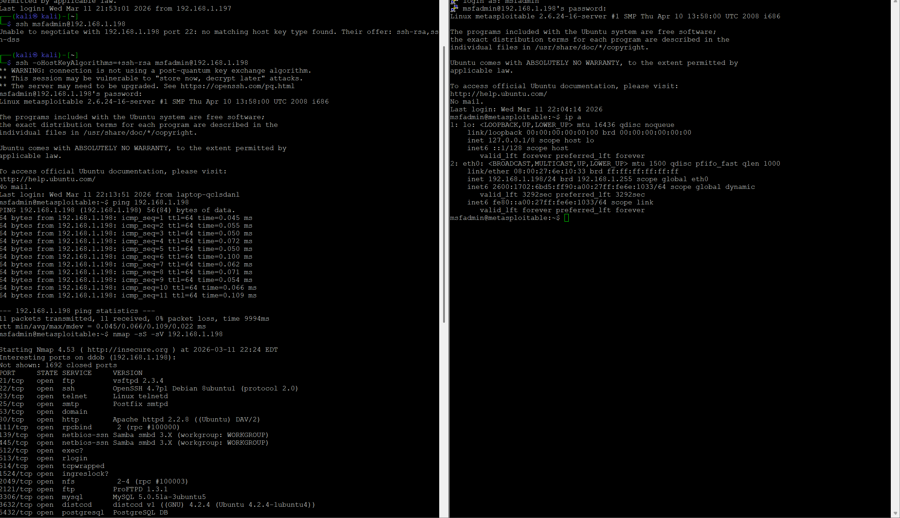
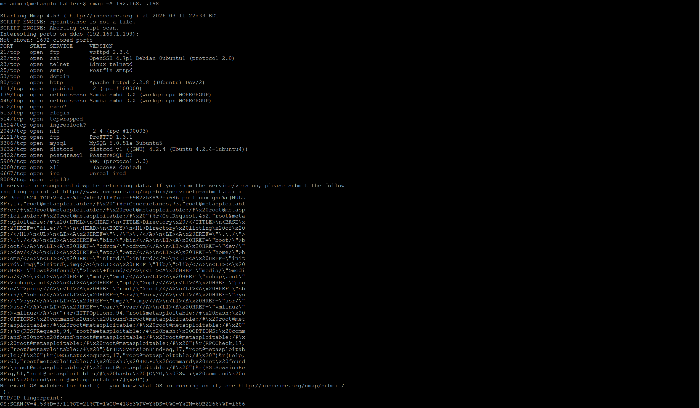
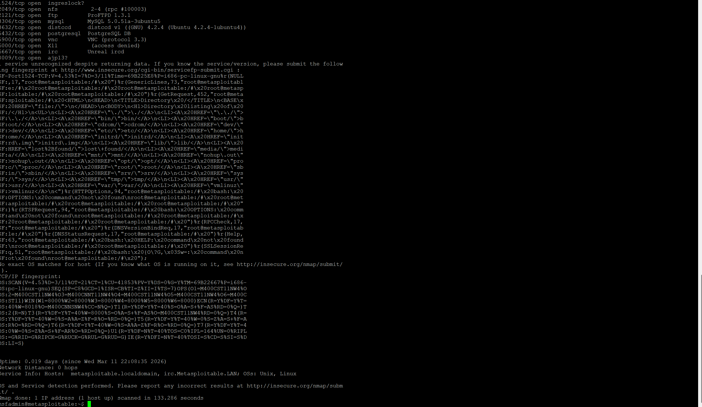

Kali Linux vs Metasploitable – Penetration Testing Lab
Project Overview

This project demonstrates the reconnaissance phase of a penetration testing exercise that I conducted using Kali Linux as the attacking machine and Metasploitable 2 as the target system. The objective of this lab was to simulate a real-world penetration testing scenario in which I identify accessible services and potential attack surfaces on a vulnerable host.

During the exercise, I established remote access to the target system, verified network connectivity between the machines, and performed service enumeration using Nmap. These activities represent the reconnaissance stage of a security assessment, where information is gathered about the target environment before moving on to vulnerability exploitation.

Lab Environment

The lab environment consisted of two virtual machines configured within the same network.

Attacker Machine
Operating System: Kali Linux
Purpose: Used to perform reconnaissance and penetration testing activities.

Target Machine
Operating System: Metasploitable 2
Purpose: An intentionally vulnerable system designed for cybersecurity training and penetration testing practice.

Both systems were deployed within a virtualized environment and configured to communicate over a shared internal network.

Establishing Remote Access via SSH

I first verified that the attacking machine could remotely access the target system using Secure Shell (SSH). Establishing remote access confirmed that the target machine was reachable and that authentication was successful.

I executed the following command from the Kali Linux system:

ssh -oHostKeyAlgorithms=+ssh-rsa msfadmin@192.168.1.198

Because the Metasploitable system uses an older SSH configuration, the option HostKeyAlgorithms=+ssh-rsa was required to allow the connection. After authentication, I successfully established a remote session with the target system.

Screenshot:

Verifying Network Connectivity

After confirming SSH access, I verified network communication between the two machines using the ping utility. This step ensured that the attacker system could consistently communicate with the target host across the network.

I executed the following command:

ping 192.168.1.198

The command generated multiple ICMP echo replies from the target system, confirming successful network connectivity between the Kali Linux machine and the Metasploitable host.

Screenshot:

Service Enumeration Using Nmap

Once connectivity had been confirmed, I conducted a network scan to identify open ports and services running on the target machine. This step was performed using Nmap, a widely used network discovery and security auditing tool.

I executed the following command:

nmap -sS -sV 192.168.1.198

The -sS parameter initiated a SYN scan, which identifies open ports by sending SYN packets and analyzing the responses without completing the full TCP handshake. This scanning technique is efficient and commonly used during penetration testing.

The -sV parameter enabled service version detection, allowing Nmap to determine the specific software and versions running on the discovered ports. Identifying service versions is critical for vulnerability assessment because outdated or misconfigured services may contain known security weaknesses.

The scan results revealed several active services on the Metasploitable system, including FTP, SSH, Telnet, SMTP, HTTP, MySQL, and Samba. These services represent potential entry points that could be explored further during subsequent stages of the penetration test.

Screenshots:

Key Findings

During the reconnaissance phase, I identified multiple exposed services running on the target system. Many of these services are intentionally vulnerable in the Metasploitable environment and are commonly used for penetration testing practice.

Examples of identified services include:

• FTP service running vsftpd
• SSH remote access service
• Telnet remote login service
• Apache HTTP web server
• MySQL database service
• Samba file sharing service

These services increase the attack surface of the system and provide several potential vectors for exploitation during later stages of a security assessment.

Conclusion

This lab demonstrates the importance of reconnaissance in penetration testing. By identifying accessible services and gathering information about the target system, I was able to map the attack surface of the vulnerable host.

The techniques demonstrated in this project reflect fundamental cybersecurity skills, including remote access validation, network connectivity verification, and service enumeration using industry-standard security tools. These activities form the foundation for vulnerability assessment and exploitation in professional penetration testing engagements.
